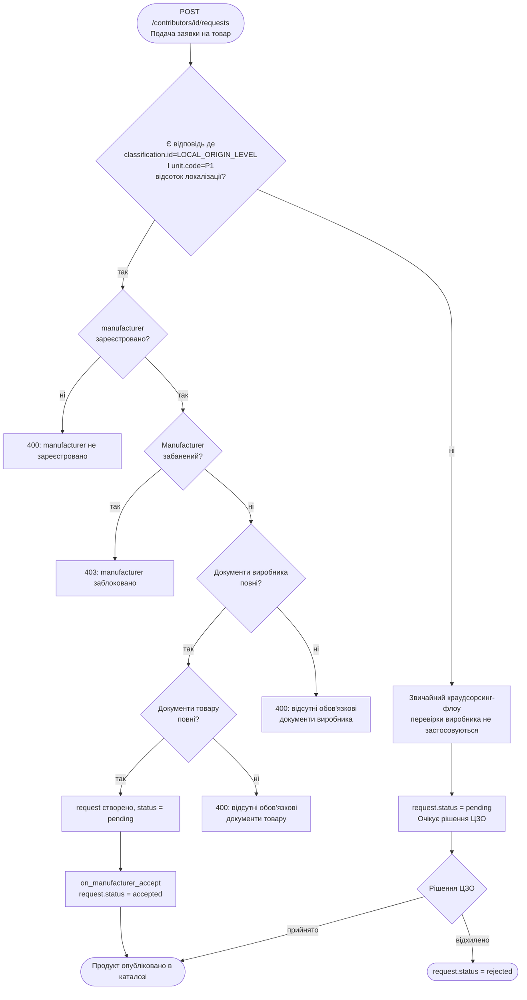

# Локалізація v3.0 — план змін у коді

Перехід на єдиний ендпоінт краудсорсингу для подачі заявок на всі типи товарів.

> **Примітка по іменуванню:** термін `isVendor` не точний — vendor у системі означає постачальника,
> тоді як нам потрібно позначити саме **виробника** локалізованого товару.
> Скрізь у коді використовуємо `isManufacturer`.

---

## Контекст

Зараз паралельно працюють два схожих за метою ендпоінти:

- **Локалізація** — `/api/vendors` (виробники, ДП адмініструє категорії)
- **Краудсорсинг** — `/api/crowd-sourcing/contributors` (постачальники, ЦЗО адмініструє)

Задача: об'єднати в один флоу через краудсорсинг, зберігши обидва сценарії поведінки
(звичайний постачальник та виробник локалізованого товару).

Маршрути `/api/vendors/*` залишаються без змін для зворотної сумісності.

---

## 1. Реєстрація виробника (крок 2) — варіанти підходу

Після реєстрації як постачальник (contributor) користувач може пройти додаткову реєстрацію виробника.
Розглядаються два варіанти реалізації.

---

### Варіант A — `PATCH isManufacturer` + окремі документи

Документи виробника додаються через існуючий `contributor/documents` endpoint (з новим обмеженим набором типів),
потім окремим PATCH виставляється прапорець `isManufacturer=true`.

**Модель (`src/catalog/models/contributor.py`)**
- Додати `isManufacturer: Optional[bool]` до `Contributor`
- Додати `ContributorManufacturerPatchData` (лише поле `isManufacturer: true`) для PATCH

**State (`src/catalog/state/contributor.py`)**
- Метод `on_manufacturer_patch` — перевірити що вже є потрібні документи (ISO, витяги),
  є підпис КЕП, виставити `isManufacturer=true`

**Handler (`src/catalog/handlers/crowd_sourcing/contributor.py`)**
- `PATCH /api/crowd-sourcing/contributors/{id}` — розширити існуючий або додати окремий view

**Плюси:** простіша структура даних, менше змін у схемі.  
**Мінуси:** документи виробника змішані із загальними документами контрибутора — розрізняти лише за типом.

---

### Варіант B — вкладений об'єкт `manufacturer` (рекомендований)

Виробник представлений як окремий об'єкт всередині контрибутора.
Документи, статус і потенційний бан — все інкапсульовано в ньому.

```json
{
  "contributor": { ... },
  "manufacturer": {
    "documents": [...],
    "dateCreated": "...",
    "dateModified": "..."
  }
}
```

**Модель (`src/catalog/models/contributor.py`)**
- Новий клас `Manufacturer` з полями: `documents`, `dateCreated`, `dateModified`
- Поле `manufacturer: Optional[Manufacturer]` у `Contributor`
- `ManufacturerPutData` для вхідних даних: опціональний список `documents`

**State (`src/catalog/state/contributor.py`)**
- Метод `on_manufacturer_put` — виставлення `dateCreated` і `dateModified`, обробка документів
- Ідемпотентність: якщо `manufacturer` вже існує → `dateCreated` не перезаписується,
  документи з повторного запиту ігноруються, повертається поточний стан об'єкта

**Handler (`src/catalog/handlers/crowd_sourcing/contributor.py`)**
- Новий view `ContributorManufacturerView`
- `PUT /api/crowd-sourcing/contributors/{id}/manufacturer` — створення або заміна запису виробника (singleton sub-ресурс, ідемпотентно)
- Якщо `manufacturer` вже існує → повернути `200 OK` з поточним станом без жодних змін

**Handler для документів (`src/catalog/handlers/crowd_sourcing/contributor_manufacturer_document.py`)**
- `POST/GET /api/crowd-sourcing/contributors/{id}/manufacturer/documents`
- `GET/PATCH /api/crowd-sourcing/contributors/{id}/manufacturer/documents/{doc_id}`

**Плюси:** чіткий REST-ресурс, документи не змішуються, легко розширити (статус, бан, підтвердження).  
**Мінуси:** більше ендпоінтів і файлів на старті.

---

### Порівняння варіантів

| | Варіант A (`isManufacturer` patch) | Варіант B (об'єкт `manufacturer`) |
|---|---|---|
| Структура даних | плоска | вкладена |
| Документи | змішані з contributor.documents | окремо в manufacturer.documents |
| Розширюваність (бан, статус) | потребує переробки | закладена одразу |
| Кількість нових ендпоінтів | 1 | 3–4 |
| Відповідність REST | ✓ | ✓✓ |

**Поточне рішення:** обрано **Варіант B**. Варіант A залишений для розуміння контексту — це попередня домовленість, від якої відійшли на користь чистішої структури.

---

## 2. Product Request — статус, документи до продукту, локалізація

### 2.1 Статус заявки

**`src/catalog/models/product_request.py`**

Додати поле `status` з enum:

| Значення | Опис |
|----------|------|
| `pending` | **Дефолт** — backward compatibility, заявка одразу на розгляді |
| `draft` | Документи до продукту можна додавати/редагувати |
| `accepted` | Продукт перенесено в каталог |
| `rejected` | Заявку відхилено |

`draft` — опціональний стан; клієнт явно передає `{"status": "draft"}` при POST якщо потребує цього флоу.

### 2.2 Документи до продукту (`request.product.documents`)

**Нові ендпоінти** — доступні лише коли `status = draft`:

```
POST   /api/crowd-sourcing/requests/{id}/product/documents
GET    /api/crowd-sourcing/requests/{id}/product/documents
PATCH  /api/crowd-sourcing/requests/{id}/product/documents/{doc_id}
DELETE /api/crowd-sourcing/requests/{id}/product/documents/{doc_id}
```

**`src/catalog/handlers/crowd_sourcing/product_request_product_document.py`** (новий файл)
- Перевірка `status = draft` перед будь-якою операцією → інакше `400`
- Документи зберігаються в `product_request.product.documents`

> Існуючі ендпоінти `request.documents` (`/requests/{id}/documents`) не чіпаємо.

### 2.3 Перехід `draft → pending` (подача на розгляд)

**`PATCH /api/crowd-sourcing/requests/{id}`**
```json
{"data": {"status": "pending"}}
```

Цей перехід є тригером всієї валідації і автоактивації:

**`src/catalog/handlers/crowd_sourcing/product_request.py`**
- Новий `ProductRequestPatchView` або розширення існуючого
- При переході `draft → pending` → запустити ланцюжок валідацій (якщо є числова відповідь на критерій `LOCAL_ORIGIN_LEVEL` з `unit.code = "P1"`) → `on_manufacturer_accept`

**`src/catalog/state/product_request.py`**
- Новий метод `on_manufacturer_accept` — підтвердження від імені ДП (без участі ЦЗО)
- Новий метод `on_submit` — перевірка дозволеності переходу статусу

**`src/catalog/validations.py`**
- `validate_manufacturer_exists(contributor)` — `contributor.manufacturer` присутній
- `validate_manufacturer_not_banned(contributor)` — manufacturer не в `bans`
- `validate_manufacturer_documents(contributor)` — всі обов'язкові типи документів виробника присутні
- `validate_product_request_documents(data)` — всі обов'язкові типи документів товару присутні

---

## 4. Документи — розділення

Незалежно від варіанту реєстрації виробника, документи діляться на три рівні:

### Документи виробника (подаються при реєстрації `manufacturer`)

Зберігаються в `contributor.manufacturer.documents`.

| # | title | documentType (з вимог) | documentType (обраний) | Обов'язково |
|---|-------|------------------------|------------------------|-------------|
| 1 | Сертифікат відповідності систем управління якістю | `certificate` | `qualityCertificate` | ✓ |
| 2 | Звіт про виробництво та реалізацію (Форма 1-НПП) | `report` | `productionReport` | ✓ |
| 3 | Додаток 4ДФ (Відомості про податки на доходи) | `report` | `taxReport` | ✓ |
| 4 | Фінансова звітність (Баланс, Форма 2/2М) | `report` | `financialReport` | ✓ |
| 5 | Файл КЕП | `vendorSignature` | `manufacturerSignature` | ✓ |

Всі 5 документів обов'язкові. Валідується наявність **кожного унікального `documentType`**, а не лише загальна кількість.

### Документи до товару (подаються в заявці `product_request`)

Зберігаються в `product_request.product.documents`.

| # | title | documentType (з вимог) | documentType (обраний) | Обов'язково |
|---|-------|------------------------|------------------------|-------------|
| 1 | Калькуляція собівартості товару | `report` | `costCalculation` | ✓ |
| 2 | Протокол випробувань щодо безпечності зразка товару | `report` | `safetyTestReport` | ✓ |
| 3 | Сертифікат відповідності, типу або свідоцтво WMI | `certificate` | `typeCertificate` | ні* |
| 4 | Довідка виробника з переліком технологічних операцій | `report` | `technologicalOperationsReport` | ✓ |
| 5 | Файл КЕП | `productSignature` | `productSignature` | ✓ |

\* Документ №3 — наразі необов'язковий: тип `certificate` дозволено подавати всім, але валідація на обов'язковість не застосовується.
Відкрите питання: чи додаємо в конфіг категорії ознаку (наприклад, `requiresVehicleCertificate`),
яка вмикає обов'язкову перевірку цього документа для колісних транспортних засобів.
До прийняття рішення — документ опціональний для всіх категорій.

**`src/catalog/handlers/crowd_sourcing/product_request.py`** (валідація документів)
- Документи товару подаються в тілі POST разом із заявкою — окремий крок завантаження відсутній
- Перевірка допустимих значень `documentType` і наявності всіх обов'язкових типів відбувається там само в `ContributorProductRequestView.post`

---

## 5. Валідація документів і правила подачі

### Підхід

`manufacturer` не має окремого поля статусу. Єдиний механізм, що змінює "стан" об'єкта —
масив `bans` (аналогічно до того як це працює для contributor зараз).

Замість переходів між статусами — **валідація в момент подачі**: окремий метод перевіряє
повноту документів безпосередньо при POST заявки. Це дозволяє вільно оновлювати документи
в будь-який момент. Майданчики на своїй стороні стежать за переліком обов'язкових файлів
і підказують користувачу що ще потрібно завантажити.

### 5.1 Флоу виробника



### 5.2 Що перевіряється при POST заявки

Тригер усіх перевірок виробника — **дворівнева** перевірка `requirementResponses` заявки:

1. Є відповідь де `classification.id = "CRITERION.OTHER.SUBJECT_OF_PROCUREMENT.LOCAL_ORIGIN_LEVEL"`
2. І ця відповідь є числовою (`unit.code = "P1"`, відсоток)

Критерій `LOCAL_ORIGIN_LEVEL` містить дві групи вимог: відсоток локалізації (число, `P1`) і країна походження (рядок, ISO коди). Нас цікавить лише перша — відповідь з числовим значенням і одиницею `P1`. Відповідь на країну походження не є тригером перевірок виробника.

Якщо відповідний `requirementResponse` відсутній — заявка обробляється як звичайний краудсорсинг, перевірки виробника не застосовуються.

> **Передумова.** Ця схема валідації коректна доки виконуються обидві умови:
> `requirementResponses` передаються при POST і не можуть бути змінені після створення заявки.
> Якщо в майбутньому з'явиться PATCH на заявку з можливістю редагувати `requirementResponses` —
> логіку валідації потрібно буде переглянути.

Якщо відповідь є, послідовно виконуються (`src/catalog/validations.py`):

1. `validate_manufacturer_exists(contributor)` — `contributor.manufacturer` присутній → інакше `400`
2. `validate_manufacturer_not_banned(contributor)` — manufacturer не в `bans` → інакше `403`
3. `validate_manufacturer_documents(contributor)` — всі обов'язкові типи присутні в `manufacturer.documents`:
   `qualityCertificate`, `productionReport`, `taxReport`, `financialReport`, `manufacturerSignature` → інакше `400` з переліком відсутніх
4. `validate_product_request_documents(data)` — всі обов'язкові типи присутні в `product.documents`:
   `report` (×3), `productSignature` → інакше `400`; тип `certificate` дозволений але не обов'язковий

### 5.3 Перевірки — зведена таблиця

| Умова | Тригер | HTTP відповідь |
|-------|--------|----------------|
| Немає відповіді на критерій локалізації | — | звичайний флоу, без перевірок виробника |
| `manufacturer` відсутній | відповідь на критерій є | `400` |
| Manufacturer в `bans` | відповідь на критерій є | `403` |
| Документи виробника неповні | відповідь на критерій є | `400` з деталями |
| Документи товару неповні | відповідь на критерій є | `400` з деталями |
| `request.status != pending` | `accept` або `reject` | `400` |

---

## 6. Ban — уніфікація під "блокування від Прозорро"

### Поточний стан (contributor ban)

Contributor ban зараз працює через акредитацію `"category"` — тобто бан може накласти ЦЗО.
Логіка прив'язана до конкретного `administrator.identifier.id`, що дозволяє кожній ЦЗО
мати окремий бан на свою зону відповідальності. Валідація при подачі заявки перевіряє
лише категорії підпорядковані забанившій організації (`validate_contributor_banned_categories`).

### Що змінюємо

**Нові бани від ЦЗО — прибираємо.**

**`src/catalog/handlers/crowd_sourcing/contributor_ban.py`**
- Прибрати `validate_accreditation(self.request, "category")` → замінити на перевірку
  токена адміністратора Прозорро (аналогічно до `validate_access_token` у vendor ban)
- Прибрати виклик `validate_contributor_ban_already_exists` — прив'язка до administrator_id
  більше не потрібна
- Бан блокує весь контрибутор-запис (всі заявки, всі категорії), а не лише одну зону ЦЗО
- Поле `administrator` залишається в структурі бану без змін — приймається з запиту,
  але завжди містить фіксований ідентифікатор ДП "ПРОЗОРРО":
  `{"id": "02426097", "legalName": "ДП \"ПРОЗОРРО\"", "scheme": "UA-EDR"}`

**`src/catalog/state/contributor_ban.py`** (новий або розширення існуючого)
- За аналогією з `VendorBanState`: виставляти `dueDate = now + 1 рік`

**`src/catalog/validations.py`**
- Замінити `validate_contributor_banned_categories` на `validate_contributor_not_banned` —
  проста перевірка наявності будь-якого активного бану без прив'язки до категорії

### Існуючі бани в проді

Бани від ЦЗО в продакшні малоймовірні, але перед релізом:

- Підготувати запит до БД: `db.contributors.find({"bans": {$exists: true, $ne: []}})`
- Якщо є — для кожного з'ясувати контекст окремо
- Якщо залишаємо → застосовувати універсальну логіку: будь-який бан в масиві блокує все

### Після релізу

Бан накладається curl-запитом з токеном адміністратора Прозорро —
аналогічно до того як зараз працює `/api/vendors/{id}/bans` (потребує перевірки
яким саме токеном авторизується цей запит у вендорів).

---

## 6. Міграція (опціонально)

**`src/catalog/migrations/cs_XXXXX_vendors_to_contributors.py`**

- Матчинг Vendor → Contributor по `identifier.id` (ЄДРПОУ)
- Варіанти: перенести вендора в існуючого контрибутора або створити новий запис контрибутора
- Виставити `isManufacturer=true` для перенесених записів
- Документи вендора → `contributor.documents` (manufacturer-тип)
- Бани вендора → `contributor.bans`
- Старі продукти вендорів реквести не матимуть (не мігруємо)

---

## Порядок реалізації

| # | Задача | Залежності |
|---|--------|------------|
| 1 | Модель + `isManufacturer` + endpoint реєстрації | — |
| 2 | Розділення типів документів | 1 |
| 3 | Product request: валідації + auto-approve | 1, 2 |
| 4 | Ban: уніфікація | 1 |
| 5 | Міграція вендорів | 1–4 (окремий реліз) |

---

## Що НЕ змінюється

- Маршрути `/api/vendors/*` — залишаються для зворотної сумісності
- Логіка відхилення заявок (rejection) — без змін
- Підтвердження заявки окремим запитом — залишається (краудсорсинг), автопідтвердження додається поверх
